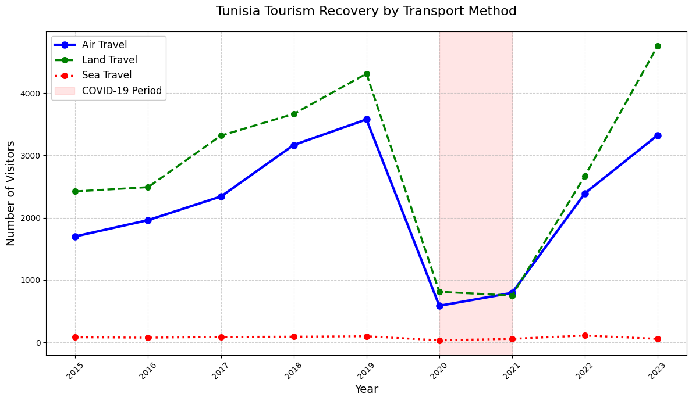
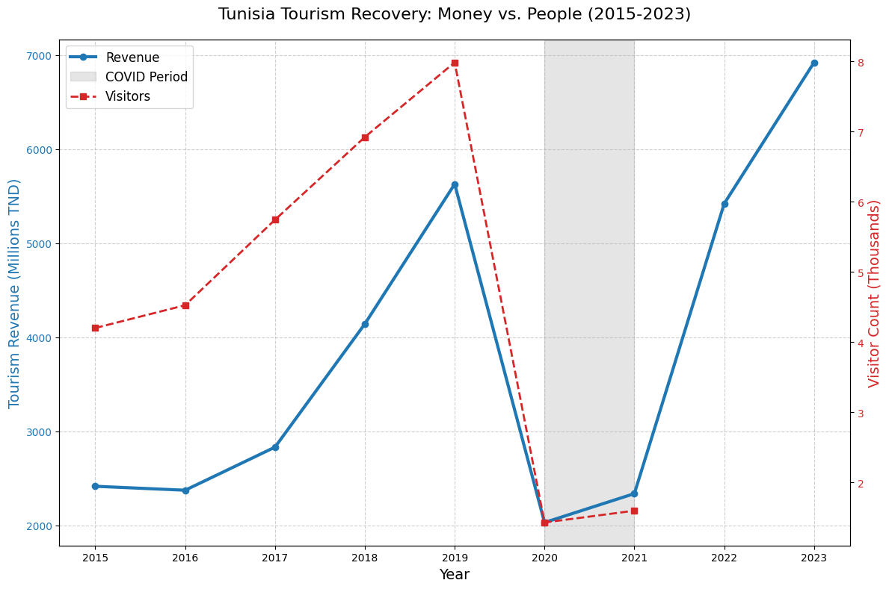
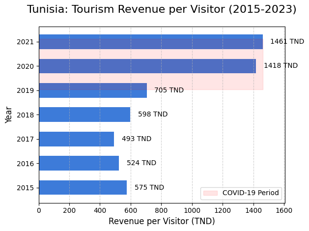
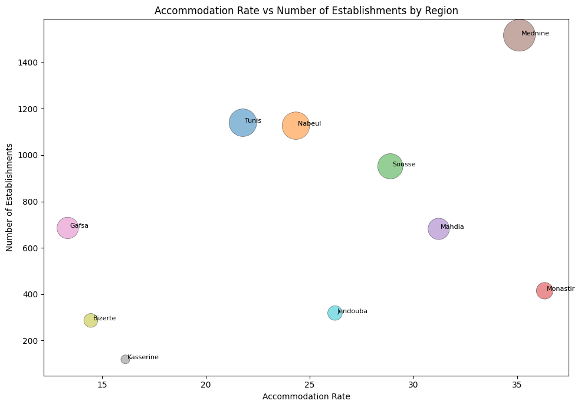

# Overview

This project analyzes trends in the tourism industry, focusing on the recovery of different markets after the COVID-19 pandemic. It explores the flow of non-resident travelers by nationality, transportation method, regional tourism infrastructure, and foreign exchange earnings.  
The goal is to identify which markets rebounded fastest, how tourists arrive, and how regional occupancy and revenue trends evolved.

# The Questions

This project answers:

1. Which tourist nationalities recovered fastest after COVID?
2. How do transportation methods and border entries vary?
3. Which regions have the most tourism establishments and highest occupancy rates?
4. How have tourism foreign exchange earnings evolved over time?

# Tools I Used

- **Python** for all data analysis
    - **Pandas** for data handling
    - **Matplotlib** & **Seaborn** for static visualizations
- **Jupyter Notebook** for combining code, analysis, and visuals
- **CSV datasets** from national tourism statistics

# Data Preparation and Cleanup

I imported multiple CSV files and cleaned it using Excel, including:

- Entries of non-resident travelers by nationality
- Entrances by transport method and border post
- Establishments by touristic region
- Foreign exchange earnings from tourism
- Occupancy rates by touristic region

Basic preprocessing steps:
```python
import pandas as pd

arrivals_nat = pd.read_csv("Entries of non-resident travelers by nationality.csv")
entrances_transport = pd.read_csv("Evolution the entrances of non-resident travelers by transport and border post.csv")
establishments = pd.read_csv("Number of establishments by touristic region.csv")
revenue = pd.read_csv("Touristic foreign exchange earnings.csv")
accomodation = pd.read_csv("Occupancy rate by touristic region.csv")
```

---

# The Analysis

## 1. Entries of Non-Residents by Nationality

This analysis reveals market recovery trends post-COVID.

  
*Line chart comparing tourist arrivals by nationality.*

**Insights:**
- Maghrebin tourists led recovery after restrictions eased.
- European arrivals grew steadily but at a slower rate.
- North American arrivals remained the smallest share.

---

## 2. Entrances by Transport Method and Border Post

This shows how visitors arrive in the country.

  
*Bar chart showing transport modes.*

**Insights:**
- Air travel dominates international arrivals.
- Road crossings show seasonal spikes, likely linked to regional events.

---

## 3. Tourism Establishments by Region

  
*Bar chart of establishments across regions.*

**Insights:**
- Coastal regions have the highest density of establishments.
- Mountain and rural areas have fewer facilities but steady occupancy.

---

## 4. Tourism Foreign Exchange Earnings

  
*Line chart of foreign exchange earnings over time.*

**Insights:**
- Revenue dipped sharply during COVID years.
- Post-pandemic rebound is strong, approaching pre-2020 highs.

---

## 5. Occupancy Rates by Region

  
*Heatmap of occupancy rates.*

**Insights:**
- Peak occupancy aligns with summer months in coastal regions.
- Urban centers maintain moderate year-round occupancy.

---

# What I Learned

- **Seasonality is key** in tourism data — patterns differ greatly by region and transport mode.
- **Data integration** from multiple CSV sources provides a fuller industry picture.
- **Visualization choice** (line vs heatmap vs bar) can highlight different aspects of the same trend.

# Challenges I Faced

- Inconsistent date formats across CSVs required manual parsing.
- Missing values in certain years for some nationalities.
- Deciding the best granularity (monthly vs yearly) for analysis.

# Conclusion

This project provides a snapshot of the tourism sector’s post-COVID recovery, with actionable insights into nationality-based trends, transport patterns, and regional performance.  
The findings can guide marketing efforts, infrastructure investment, and seasonal planning in the tourism industry.
