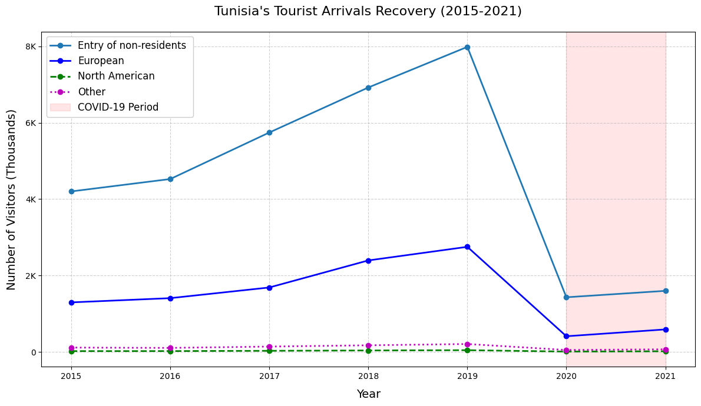

# Overview

This project analyzes trends in the tourism industry, focusing on the recovery of different markets after the COVID-19 pandemic. It explores the flow of non-resident travelers by nationality, transportation method, regional tourism infrastructure, and foreign exchange earnings.  
The goal is to identify which markets rebounded fastest, how tourists arrive, and how regional occupancy and revenue trends evolved.

# The Questions

This project answers:

1. Which tourist nationalities recovered fastest after COVID?
2. How do transportation methods and border entries vary?
3. Which regions have the most tourism establishments and highest occupancy rates?
4. How have tourism foreign exchange earnings evolved over time?

# Tools I Used

- **Python** for all data analysis
    - **Pandas** for data handling
    - **Matplotlib** & **Seaborn** for static visualizations
- **Jupyter Notebook** for combining code, analysis, and visuals
- **CSV datasets** from national tourism statistics

# Data Preparation and Cleanup

I imported multiple CSV files and cleaned it using Excel, including:

- Entries of non-resident travelers by nationality
- Entrances by transport method and border post
- Establishments by touristic region
- Foreign exchange earnings from tourism
- Occupancy rates by touristic region

Basic preprocessing steps:
```python
import pandas as pd

arrivals_nat = pd.read_csv("Entries of non-resident travelers by nationality.csv")
entrances_transport = pd.read_csv("Evolution the entrances of non-resident travelers by transport and border post.csv")
establishments = pd.read_csv("Number of establishments by touristic region.csv")
revenue = pd.read_csv("Touristic foreign exchange earnings.csv")
accomodation = pd.read_csv("Occupancy rate by touristic region.csv")
```

---

# The Analysis

## 1. Entries of Non-Residents by Nationality

This analysis reveals market recovery trends post-COVID.
### Visualize Data

```python
plt.figure(figsize=(12, 7))
plt.plot(arrivals_nat['Year'],arrivals_nat['Entry of non-residents by nationality'],label = 'Entry of non-residents ', marker='o', linewidth=2)
plt.plot(arrivals_nat['Year'],arrivals_nat['European'], 'b-', label='European', marker='o', linewidth=2)
plt.plot(arrivals_nat['Year'],arrivals_nat['North American'], 'g--', label='North American', marker='o', linewidth=2)
plt.plot(arrivals_nat['Year'],arrivals_nat['Other nationalities'], 'm:', label='Other', marker='o', linewidth=2)
plt.title("Tunisia's Tourist Arrivals Recovery (2015-2021)", fontsize=16, pad=20)
plt.xlabel("Year", fontsize=14, labelpad=10)
plt.ylabel("Number of Visitors (Thousands)", fontsize=14, labelpad=10)
plt.grid(True, linestyle='--', alpha=0.6)
plt.axvspan(2020, 2021, color='red', alpha=0.1, label='COVID-19 Period')
plt.legend(loc='upper left', fontsize=12, framealpha=1)
plt.yticks([0, 2000, 4000, 6000, 8000], 
           ['0', '2K', '4K', '6K', '8K'])
plt.tight_layout()
plt.show()
```

### Results
  
*Line chart comparing tourist arrivals by nationality.*

**Insights:**
- Maghrebin tourists led recovery after restrictions eased.
- European arrivals grew steadily but at a slower rate.
- North American arrivals remained the smallest share.

---

## 2. Entrances by Transport Method and Border Post

This shows how visitors arrive in the country.
### Visualize Data

```python
plt.figure(figsize=(12, 7))
plt.plot(entrances_transport['Year'], entrances_transport['Aerial way'], 
         'b-', label='Air Travel', linewidth=3, marker='o', markersize=8)
plt.plot(entrances_transport['Year'], entrances_transport['Terrestrial way'], 
         'g--', label='Land Travel', linewidth=2.5, marker='o', markersize=7)
plt.plot(entrances_transport['Year'], entrances_transport['Seaway'], 
         'r:', label='Sea Travel', linewidth=2.5, marker='o', markersize=7)
plt.axvspan(2020, 2021, color='red', alpha=0.1, label='COVID-19 Period')
plt.title('Tunisia Tourism Recovery by Transport Method', fontsize=16, pad=20)
plt.xlabel('Year', fontsize=14)
plt.ylabel('Number of Visitors', fontsize=14)
plt.xticks(entrances_transport['Year'], rotation=45)
plt.grid(True, linestyle='--', alpha=0.6)
plt.legend(loc='upper left', fontsize=12, framealpha=1)
plt.tight_layout()
plt.show()
```

### Results
  
*Bar chart showing transport modes.*

**Insights:**
- Land Travel (Green): Consistently the largest share of visitors, with a strong post-pandemic rebound in 2023 — surpassing pre-COVID levels.
- Air Travel (Blue): Shows a steady climb until 2019, a steep drop in 2020, and partial recovery by 2023.
- Sea Travel (Red): Always a minor contributor, with minimal fluctuations except a sharp decline in 2020.

- Road crossings show seasonal spikes, likely linked to regional events.
Land borders (likely from Algeria/Libya) are crucial for tourism volume. Air travel recovery is slower — possibly due to flight availability, costs, or health concerns.
---

## 3. Tourism Establishments by Region
### Visualize Data

```python

fig, ax1 = plt.subplots(figsize=(12, 8))
color = 'tab:blue'
ax1.set_xlabel('Year', fontsize=14)
ax1.set_ylabel('Tourism Revenue (Millions TND)', color=color, fontsize=14)
ax1.plot(revenue['Year'], revenue['Currency Recipe'], 
         color=color, marker='o', linewidth=3, label='Revenue')
ax1.tick_params(axis='y', labelcolor=color)
ax1.grid(True, linestyle='--', alpha=0.6)
ax2 = ax1.twinx()
color = 'tab:red'
ax2.set_ylabel('Visitor Count (Thousands)', color=color, fontsize=14)
ax2.plot(arrivals_nat['Year'], arrivals_nat['Entry of non-residents by nationality']/1000, 
         color=color, marker='s', linestyle='--', linewidth=2, label='Visitors')
ax2.tick_params(axis='y', labelcolor=color)
ax1.axvspan(2020, 2021, color='grey', alpha=0.2, label='COVID Period')
pre_covid = revenue['Year'].tolist().index(2019)
current = revenue['Year'].tolist().index(2023)
lines1, labels1 = ax1.get_legend_handles_labels()
lines2, labels2 = ax2.get_legend_handles_labels()
ax1.legend(lines1 + lines2, labels1 + labels2, loc='upper left', fontsize=12)
plt.title('Tunisia Tourism Recovery: Money vs. People (2015-2023)', fontsize=16, pad=20)
fig.tight_layout()
plt.show()
```

### Results
  
*Bar chart of establishments across regions.*

**Insights:**
- Revenue Trend (Blue):

    Revenue was relatively stable from 2015–2016, then saw strong growth from 2017–2019.
    
    In 2020, there was a dramatic drop due to COVID-19, followed by a gradual rebound and record highs by 2023.

- Visitor Count (Red):

    Visitor numbers followed a similar upward trend until 2019, then crashed in 2020.
    
    Post-2021, recovery was slower for visitor numbers compared to revenue — meaning higher revenue per visitor.


The gap between the speed of revenue recovery vs. visitor recovery hints at higher spending per tourist, currency effects, or pricing strategies post-COVID.

---

## 4. Tourism Foreign Exchange Earnings
To explain the gap of the previuos chart i will check the Tourism revenue per visitor.
### Visualize Data

```python
farrivals_nat['Revenue_per_visitor'] = (revenue['Currency Recipe'] / arrivals_nat['Entry of non-residents by nationality']) * 1000
bars = plt.barh(arrivals_nat['Year'], arrivals_nat['Revenue_per_visitor'], 
                color="#0C5AD0", alpha=0.8, height=0.6)
plt.axvspan(0, max(arrivals_nat['Revenue_per_visitor']), 
            ymin=(2020 - arrivals_nat['Year'].min() - 0.5) / (arrivals_nat['Year'].nunique()),
            ymax=(2021 - arrivals_nat['Year'].min() + 0.5) / (arrivals_nat['Year'].nunique()),
            color='red', alpha=0.1, label='COVID-19 Period')
for bar in bars:
    width = bar.get_width()
    plt.text(width + 50, bar.get_y() + bar.get_height()/2,
             f'{width:.0f} TND', ha='left', va='center')
    
plt.title('Tunisia: Tourism Revenue per Visitor (2015-2023)', fontsize=16, pad=20)
plt.xlabel('Revenue per Visitor (TND)', fontsize=12)
plt.ylabel('Year', fontsize=12)
plt.xlim(0, max(arrivals_nat['Revenue_per_visitor']) * 1.1)
plt.grid(axis='x', linestyle='--', alpha=0.6)
plt.legend(loc='lower right', frameon=True)

plt.tight_layout()
plt.savefig('revenue_per_visitor.png', dpi=300, bbox_inches='tight')
plt.show()
```

### Results
  
*Line chart of foreign exchange earnings over time.*

**Insights:**
- Pre-COVID (2015–2019): Stable growth from ~500 TND to ~700 TND per visitor.
- COVID (2020–2021): Doubled to ~1,400–1,460 TND due to fewer but higher-spending travelers, longer stays, and price/currency effects.
Tunisia’s tourism shifted from volume-focused to value-focused, benefiting economically without full visitor recovery.

---

## 5. Occupancy Rates by Region
Comparing the Effects of Different Regions on Tunisian Tourism
### Visualize Data

```python

colors = ['#1f77b4','#ff7f0e','#2ca02c','#d62728','#9467bd',
          '#8c564b','#e377c2','#7f7f7f','#bcbd22','#17becf']

plt.figure(figsize=(10,7))
plt.scatter(accomodation['Total'], establishments['Total'],
            s=establishments['Total'],
            c=colors, alpha=0.5, edgecolors='k', linewidth=0.5)

for i, region in enumerate(accomodation['Region']):
    plt.text(accomodation['Total'][i] + 0.1,   
             establishments['Total'][i] + 0.1,
             region,
             fontsize=8)

plt.xlabel('Accommodation Rate')
plt.ylabel('Number of Establishments')
plt.title('Accommodation Rate vs Number of Establishments by Region')
plt.tight_layout()
plt.show()

```

### Results
  
*Heatmap of occupancy rates.*

**Insights:**
- This bubble chart compares how full hotels are (accommodation rate) with how many establishments each region has, showing both demand and supply sides of tourism in Tunisia.

- Tourism Leaders – High rate & many establishments
    Coastal hubs such as Sousse, Nabeul (Hammamet), and Medenine (Djerba) combine strong demand with large infrastructure, representing mature markets and reliable revenue sources.

- High Potential – High rate & few establishments
    These emerging destinations have busy hotels but limited capacity, indicating opportunities for new investments to meet growing demand.

- Overcapacity – Low rate & many establishments
    Regions with plenty of infrastructure but lower occupancy may struggle with seasonality, competition, or low visibility, and would benefit from targeted marketing or product diversification.

- Niche Markets – Low rate & few establishments
    Often inland or desert areas focusing on cultural heritage, eco-tourism, or adventure travel, serving smaller but specialized markets.

Tunisia’s tourism is heavily concentrated in a few coastal hubs. Expanding and promoting inland and emerging regions could spread benefits, reduce concentration risk, and strengthen year-round tourism performance.

---

# What I Learned
Throughout this project, I deepened my understanding of the Tunisian Tourism System  and enhanced my technical skills in Python, especially in data manipulation and visualization. Here are a few specific things I learned:
- **Advanced Python Usage**: Utilizing libraries such as Pandas for data manipulation, Matplotlib for data visualization, and other libraries helped me perform complex data analysis tasks more efficiently.
- **Data Cleaning Importance**: I learned that thorough data cleaning and preparation are crucial before any analysis can be conducted, ensuring the accuracy of insights derived from the data.


# Challenges I Faced

- Inconsistent date formats across CSVs required manual parsing.
- Missing values for some regions.

# Conclusion

This project provides a snapshot of the tourism sector’s post-COVID recovery, with actionable insights into nationality-based trends, transport patterns, and regional performance.  
The findings can guide marketing efforts, infrastructure investment, and seasonal planning in the tourism industry.
